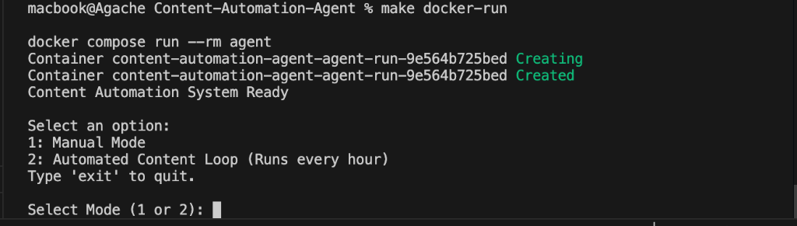
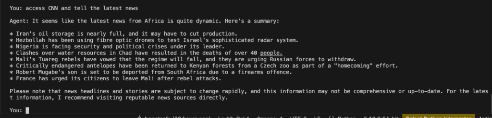
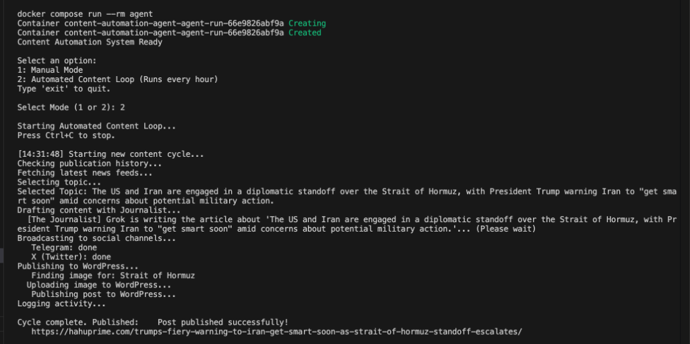

# Content Automation Agent

A modular content pipeline designed to research, draft, publish, and distribute articles across multiple platforms. Powered by LangGraph for deterministic state-machine orchestration and local LLMs for curation.

For a technical deep dive, see the [System Architecture Guide](docs/architecture.md).

## ✨ Features

- **State-Machine Orchestration**: Reliable LangGraph loop for consistent execution.
- **Multi-LLM Resilience**: Primary synthesis via Grok 4.1 with automated failover to Gemini 2.5 Flash.
- **Omnichannel Support**: Integration for WordPress, Telegram, and X (Twitter).
- **Audit System**: SQLite-based duplicate prevention and activity logging.
- **CI/CD Ready**: Professional GitHub Actions and Docker configuration.

---

## 🚀 Results Showcase

### 🏁 System Entry Point


### 🤖 Manual Mode (Direct Research)


### 🖥️ Terminal Output (Automated Orchestration)


### 🌐 Live WordPress Result


### 📢 Telegram Broadcast (Real-time)


---

## 🛠️ Quick Start

### 1. Configure Environment
Clone the repo and create your `.env` file from the template:
```bash
cp .env.example .env
# Edit .env with your API keys
```

### 2. Run via Docker (Recommended)
```bash
make docker-build
make docker-run
```

### 3. Native Setup
```bash
make setup
make run
```

---

## 📖 Documentation & Architecture

For a deep dive into the system design, C4 diagrams, and technical advantages, please refer to the **[System Architecture Guide](docs/architecture.md)**.

---

## 🤝 Contributing

Contributions are welcome! Please see our **[Contributing Guidelines](CONTRIBUTING.md)** for details on how to get started.

---

## 👤 Developer

**Tesfay G Chekole**  
*Machine Learning Engineer, Co-Founder @ [HahuScholar](https://hahuscholar.com)*  
- LinkedIn: [hopetesfa](https://www.linkedin.com/in/hopetesfa/)
- X (Twitter): [@hopegeb](https://twitter.com/hopegeb)
