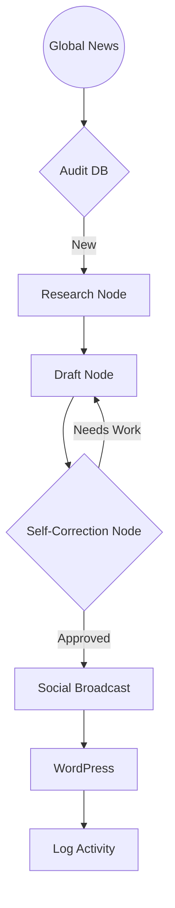

# Content-Automation-Agent

A LangGraph-based agentic pipeline for automated news research, drafting, and multi-platform distribution. Features a deterministic state machine with a self-correction loop for content quality control.

> [!CAUTION]
> **DISCLAIMER**: This tool is designed for automated content generation and publication. It is provided for educational and productivity purposes only. The user is solely responsible for all content published. Always review AI-generated content for accuracy and compliance with third-party platform terms of service. Use at your own risk.

---

## ✨ Features

- **Self-Correction Loop**: Uses a reflective node to critique and refine drafts before publication.
- **LangGraph Orchestration**: Deterministic state machine for reliable pipeline execution.
- **Multi-Layered Memory**: Duplicate prevention using LLM context and fuzzy string matching.
- **Research Fallback**: Automated category pivoting (e.g., Trending → World) to maintain content flow.
- **API Resilience**: Exponential backoff retries and persistent session management for CMS/Social APIs.
- **Omnichannel Support**: Native integration for WordPress, Telegram, and X (Twitter).

---

## 🚀 Results Showcase

### 🤖 Manual Mode (Interactive Research)


### 🖥️ Terminal Output (Automated Loop)


### 🌐 Live WordPress Result


---

## 🛠️ Quick Start

### 📋 Prerequisites

| Component | Minimum Version | Requirement |
| :--- | :--- | :--- |
| **Python** | 3.9+ | Required for native setup |
| **Docker** | 24.0+ | Recommended for isolated execution |
| **Ollama** | Latest | Running locally with `llama3.2:3b` |
| **API Keys** | N/A | Grok (X.ai), Gemini (Optional), Pexels |

### 1. Configure Environment
Clone the repo and create your `.env` file from the template:
```bash
cp .env.example .env
# Edit .env with your API keys
```

### 2. Execution (Docker Recommended)
```bash
make docker-build
make docker-run
```

### 3. Native Execution
```bash
make setup
make run
```

---

## 📖 Documentation & Architecture

The system utilizes a state machine to ensure content quality and distribution reliability.



For a technical deep dive, see the **[System Architecture Guide](docs/architecture.md)**.

---

## 🤝 Contributing

Contributions are welcome! Please see our **[Contributing Guidelines](CONTRIBUTING.md)** for details.

---

## 👤 Developer

**Tesfay G Chekole**  
*Machine Learning Engineer, Co-Founder @ [HahuScholar](https://hahuscholar.com)*  
- LinkedIn: [hopetesfa](https://www.linkedin.com/in/hopetesfa/)
- X (Twitter): [@hopegeb](https://twitter.com/hopegeb)
