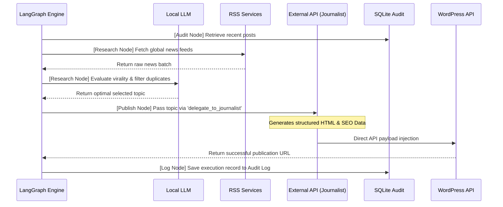

# System Architecture

The Content Automation Agent is designed using a **decoupled, modular architecture**, ensuring maximum stability, testability, and upgradeability.

## 1. Directory Structure

- **`core/`**: Orchestration logic and initialization. Contains LangGraph workflows, LangChain configuration, and environment variables.
- **`tools/`**: The abstraction layer. These are LangChain `@tool` functions that connect the orchestration engine to physical system actions.
- **`services/`**: The integration layer. Pure Python classes that interact with external APIs (WordPress, Grok, Pexels, SQLite). These have zero dependency on the orchestration framework, making them completely reusable.
- **`tests/`**: Pytest suite using mocked HTTP responses to guarantee system integrity without consuming live API quotas.

---

## 2. Orchestration Pipeline

The system utilizes a LangGraph StateGraph to deterministically manage the content generation loop, decoupling the strict workflow sequence from the local model's reasoning constraints.

## 3. Architectural Advantages
1. **Deterministic Execution**: By utilizing a state machine (LangGraph) rather than a dynamic agent loop (ReAct), the pipeline mathematically guarantees the sequence of operations (Audit -> Research -> Publish -> Log). This entirely eliminates infinite loops and hallucinated tool calls.
2. **Resource Efficiency**: The local, low-parameter model is utilized exclusively for lightweight evaluation tasks (duplicate checking and topic selection). The computationally expensive task of generating structured HTML and SEO data is delegated to a specialized external API, preserving local system resources.
3. **Data Integrity**: The pipeline passes the generated HTML payload directly from the secondary model to the WordPress API. This prevents the primary local orchestrator from truncating or corrupting the payload due to context window limitations.
4. **Fault Tolerance**: Network interfaces implement exponential backoff and automated retries via the `tenacity` library, ensuring silent recovery from intermittent API failures during unattended background execution.
