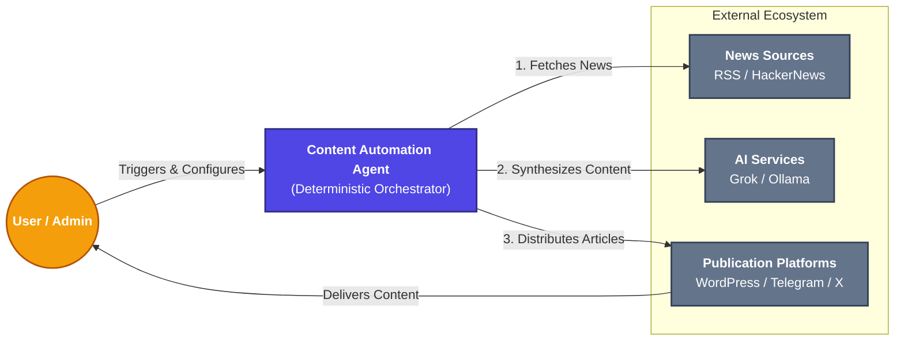
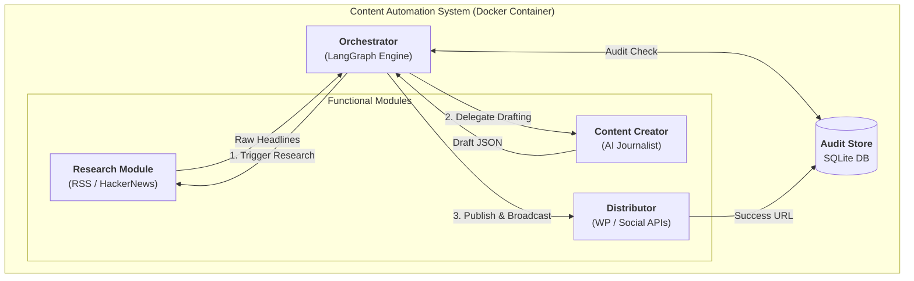
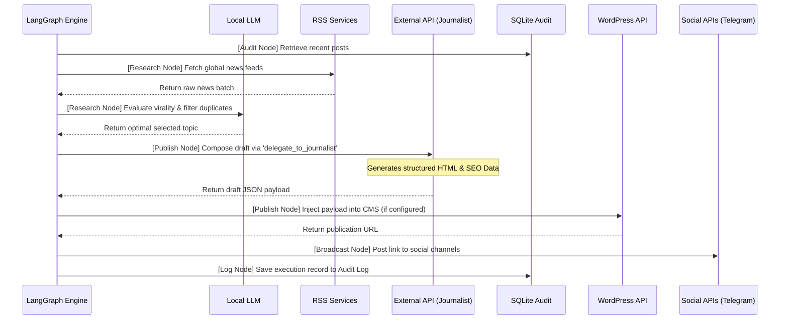

# System Architecture

The Content Automation Agent is designed using a **decoupled, modular architecture**, ensuring maximum stability, testability, and upgradeability.

## 1. System Context Diagram (Level 1)

This high-level diagram shows the Content Automation Agent as a central system and its relationships with external users and third-party ecosystems.

## 2. Container Diagram (Level 2)

This diagram illustrates the logical containers within the system and how data flows through the deterministic pipeline.

### Data Inputs & Outputs
| Entity | Type | Description |
| :--- | :--- | :--- |
| **Inputs** | Raw Headlines | Fetched from global RSS feeds and HackerNews. |
| **Input** | Configuration | API Keys and Preferences loaded via `.env`. |
| **Output** | HTML Post | A fully formatted SEO article published to WordPress. |
| **Output** | Broadcast | Real-time notifications sent to Telegram and X (Twitter) APIs. |
| **Output** | Audit Log | A record of the transaction stored in `agent_audit.db`. |

---

## 3. Directory Structure

- **`core/`**: Orchestration logic and initialization. Contains LangGraph workflows, LangChain configuration, and environment variables.
- **`tools/`**: The abstraction layer. These are LangChain `@tool` functions that connect the orchestration engine to physical system actions.
- **`services/`**: The integration layer. Pure Python classes that interact with external APIs (WordPress, Grok, Pexels, SQLite). These have zero dependency on the orchestration framework, making them completely reusable.
- **`tests/`**: Pytest suite using mocked HTTP responses to guarantee system integrity without consuming live API quotas.
- **`Makefile`**: Developer CLI for setup, testing, and deployment across different operating systems.
- **`pyproject.toml`**: Modern project configuration, metadata, and dependency management.

---

## 4. Orchestration Pipeline

The system utilizes a LangGraph StateGraph to deterministically manage the content generation loop, decoupling the strict workflow sequence from the local model's reasoning constraints.

## 5. Workflow Modes

The system supports two primary operational modes:

*   **Mode 1: Manual Mode**: Direct interface with the orchestration model via the terminal. This allows users to give specific research instructions or query the audit logs manually.
*   **Mode 2: Automated Content Loop**: A continuous background process that executes the full StateGraph pipeline at a fixed interval (default: 1 hour). This mode handles the entire lifecycle from news ingestion to social broadcasting without human intervention.

## 6. Architectural Advantages
1. **Deterministic Execution**: By utilizing a state machine (LangGraph) rather than a dynamic agent loop (ReAct), the pipeline mathematically guarantees the sequence of operations (Audit -> Research -> Publish -> Log). This entirely eliminates infinite loops and hallucinated tool calls.
2. **Resource Efficiency**: The local, low-parameter model is utilized exclusively for lightweight evaluation tasks (duplicate checking and topic selection). The computationally expensive task of generating structured HTML and SEO data is delegated to a specialized external API, preserving local system resources.
3. **Data Integrity**: The pipeline passes the generated HTML payload directly from the secondary model to the WordPress API. This prevents the primary local orchestrator from truncating or corrupting the payload due to context window limitations.
4. **Fault Tolerance & Stability**: By utilizing official APIs (e.g., Telegram, WordPress) rather than browser automation (Selenium), the system avoids the fragility of UI changes. Network interfaces implement exponential backoff and automated retries via the `tenacity` library, ensuring silent recovery from intermittent API failures during unattended background execution.
