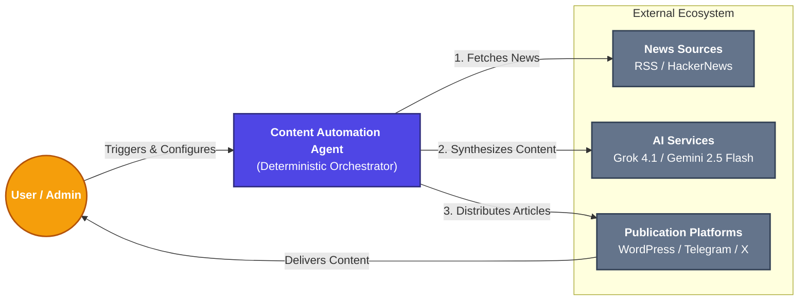
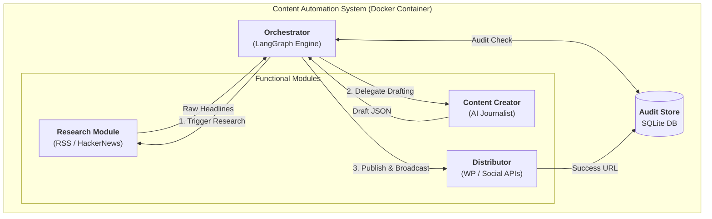
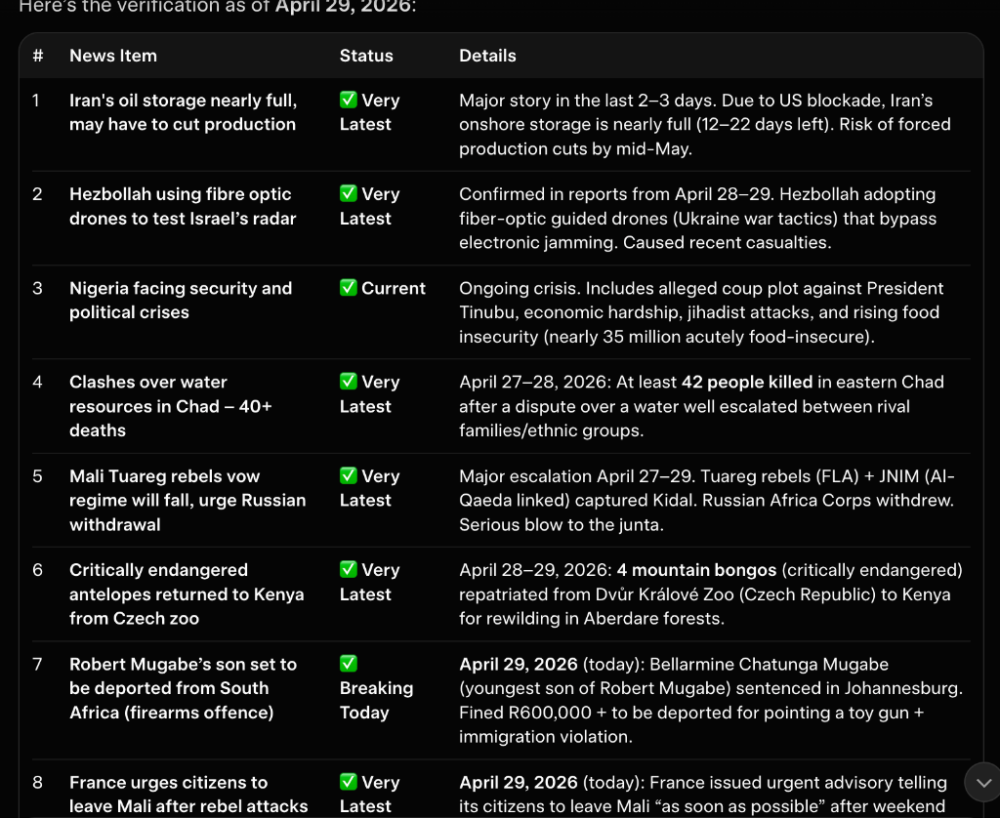

# System Architecture

The Content Automation Agent is designed using a **decoupled, modular architecture**, ensuring maximum stability, testability, and upgradeability.

## 1. System Context Diagram (Level 1)

This high-level diagram shows the Content Automation Agent as a central system and its relationships with external users and third-party ecosystems.

## 2. Container Diagram (Level 2)

This diagram illustrates the logical containers within the system and how data flows through the deterministic pipeline.

### Data Inputs & Outputs
| Entity | Type | Description |
| :--- | :--- | :--- |
| **Inputs** | Raw Headlines | Fetched from global RSS feeds (Trending vs Global). |
| **Input** | Configuration | API Keys and Preferences loaded via `.env`. |
| **Output** | HTML Post | A fully formatted SEO article published to WordPress Website. |
| **Output** | Broadcast | Real-time notifications sent to Telegram and X (Twitter) APIs. |
| **Output** | Audit Log | A record of the transaction stored in `agent_audit.db`. |

---

## 3. Technical Core Advantages

### 🛡️ Multi-Layered Duplication Prevention
The system implements a hardened memory system to ensure no topic is ever repeated, even across container restarts:
- **Layer 1 (AI Context)**: The orchestrator injects the last 30 published topics directly into the LLM's prompt with strict negative constraints.
- **Layer 2 (Python Safety Check)**: A secondary code-level check performs string similarity analysis on every chosen topic. If a match is detected, the cycle is terminated before any resources are consumed.
- **Persistent Volumes**: In Docker environments, the SQLite database is mapped via host volumes, ensuring the agent "remembers" its history even after being stopped or rebuilt.

### 🔄 High-Availability & Resilience
- **Persistent Sessions**: The WordPress service utilizes `requests.Session` with custom `User-Agent` headers to mitigate SSL EOF errors and WAF blocking.
- **Automated Retries**: Critical paths (CMS uploads, Media fetching) implement exponential backoff via the `tenacity` library, allowing the agent to silently recover from transient DNS or network resolution failures.
- **Multi-LLM Strategy**: Primary synthesis via Grok 4.1 Fast with a seamless fallback to Gemini 2.5 Flash ensures the content pipeline never stalls.

---

## 4. Directory Structure

- **`core/`**: Orchestration logic and initialization. Contains LangGraph workflows and environment configuration.
- **`tools/`**: The abstraction layer. LangChain `@tool` functions connecting the engine to system actions.
- **`services/`**: The integration layer. Pure Python classes for API interaction (WP, Grok, Pexels, SQLite).
- **`tests/`**: Pytest suite using mocked HTTP responses to guarantee system integrity.

---

## 5. Workflow Modes

- **Manual Mode**: Direct terminal interaction for specific research or audit queries.
- **Automated Content Loop**: A continuous background process executing the full pipeline hourly.

---

## 6. Technical Verification Snapshot

The system's accuracy is verified against live global events. Snapshot as of **April 29, 2026**:

