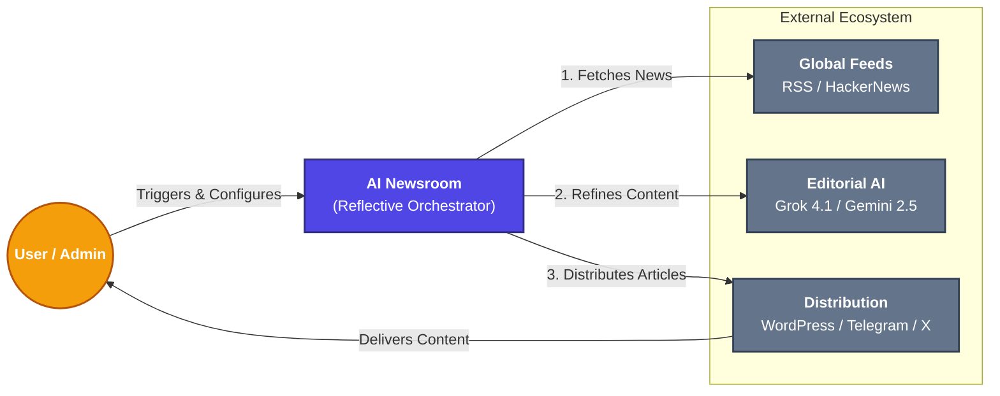
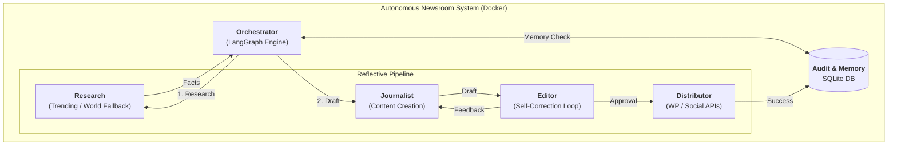

# System Architecture: Content-Automation-Agent

The Content-Automation-Agent is designed using a **deterministic, reflective architecture**, ensuring that every published article undergoes a rigorous automated editorial process.

## 1. System Context Diagram (Level 1)

This high-level diagram shows the Newsroom as a central system and its relationships with external users and third-party ecosystems.

## 2. Container Diagram (Level 2) - The Reflective Loop

This diagram illustrates the logical containers within the system and how the **Self-Correction Loop** ensures high-fidelity output.

### Data Inputs & Outputs
| Entity | Type | Description |
| :--- | :--- | :--- |
| **Inputs** | Raw Headlines | Fetched from global feeds (Trending first, then World fallback). |
| **Input** | Editorial Context | LLM-driven feedback during the self-correction loop. |
| **Output** | HTML Post | A fully formatted, edited SEO article published to WordPress. |
| **Output** | Broadcast | Real-time notifications sent to Telegram and X (Twitter) APIs. |
| **Output** | Audit Log | A record of the transaction stored in `agent_audit.db`. |

---

## 3. Technical Core Advantages

### 🧠 The Self-Correction Node
Unlike linear automation scripts, this system features a **reflective feedback loop**. The Editor node evaluates the Journalist's draft against quality, SEO, and engagement metrics. If the draft is insufficient, it is sent back for revision with specific improvement instructions. This ensures that only "8/10" or better content is ever published.

### 🛡️ Multi-Layered Duplication Prevention
- **Layer 1 (AI Context)**: The orchestrator injects the last 30 published topics into the Research prompt.
- **Layer 2 (Python Safety Check)**: A secondary code-level check performs string similarity analysis on every chosen topic.
- **Persistent Volumes**: Host-mapped SQLite database ensures memory persists across container restarts.

### 🔄 Resilient Newsroom Infrastructure
- **Category Fallback**: If no unique "Trending" news is found, the system automatically pivots to "World" categories to maintain content flow.
- **Automated Retries**: Critical paths (CMS uploads, Social APIs) implement exponential backoff via the `tenacity` library.
- **Session Stability**: Uses `requests.Session` with custom user-agents to prevent SSL/WAF interruptions.

---

## 4. Workflow Modes
- **Manual Mode**: Direct interaction for niche research or history auditing.
- **Automated News Loop**: A continuous background process executing the reflective pipeline hourly.

---

## 5. Directory Structure
- **`core/`**: Orchestration logic (LangGraph) and Newsroom configuration.
- **`tools/`**: The abstraction layer for system actions (WP, Social, Research).
- **`services/`**: The integration layer for pure API interaction (Requests, GenAI).
- **`tests/`**: Pytest suite for memory, ingestion, and orchestration verification.
